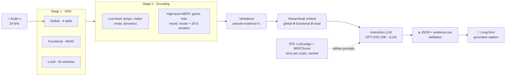
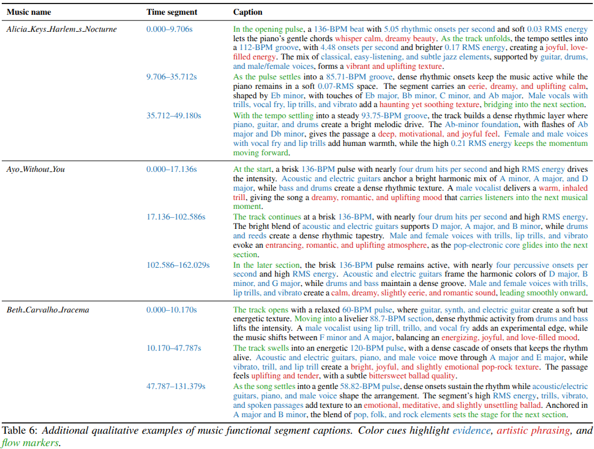
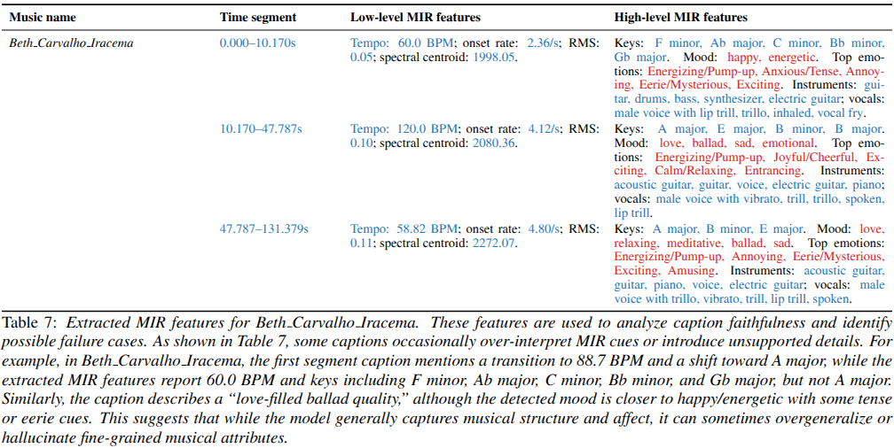

<div align="center">

# 🎼 Music Artistic Captioning (MAC)

### *Towards Translating Music into Expressive Language*

**Accepted at INTERSPEECH 2026** 🎉

[](https://www.interspeech2026.org/)
[](#-citation)
[](https://arxiv.org/abs/XXXX.XXXXX)
[](#-why-mac)
[](LICENSE)
[](https://www.python.org/)

**[Ubaid Ullah](mailto:ubaid@yu.ac.kr)¹ · [Hyun-Chul Choi](mailto:pogary@ynu.ac.kr)¹˒\* · [Zied Bouraoui](mailto:zied.bouraoui@cril.fr)²˒\***

¹ ICVS Lab, Dept. of Electronic Engineering, Yeungnam University, Gyeongsan, South Korea
² Univ. Artois, CRIL CNRS, Lens, France
<sub>\* Corresponding authors</sub>

</div>

---

> **TL;DR** — **MAC** turns a piece of music (even something as long and narrative-rich as a Wagner *opera*) into a long-form, faithful, *expressive* description — **with no training and no paired audio–text data**. It segments audio at three scales, extracts low- and high-level evidence, verbalizes it as constrained *pseudo-evidence*, and conditions an instruction-following LLM to narrate hierarchically. A one-time Iterative Prompt Optimization (IPO) pass calibrates the narrative voice while keeping captions grounded in what the music actually does.

<p align="center">
  
</p>

---

## ✨ Why MAC?

Most music captioners hit a wall on long, evolving, story-like pieces. MAC was built to climb it.

- 🚫 **No paired data, no fine-tuning.** A fully training-free, modular pipeline — it sidesteps the scarcity of paired audio–text corpora and the style overfitting / weak transfer that fine-tuning brings.
- 🎚️ **Multi-scale by design.** Segments audio at **global**, **functional**, and **local** scales, then encodes both *low-level acoustics* (tempo, meter, onset rate, dynamics) and *high-level semantics* (instrument, genre, mood, vocals, tags, and a 28-D emotion vector).
- 🔒 **Grounded, not hallucinated.** Evidence is verbalized into constrained *pseudo-evidence slots* that anchor what the LLM is allowed to claim; a deterministic check validates the JSON and confirms each caption actually references audio evidence.
- 📜 **Long-horizon & coherent.** Hierarchical context (global summary ⊕ functional ⊕ local, with neighboring segments) keeps minutes-long narration consistent across sections.
- 🎭 **Controllable narration.** A one-time **IPO** loop balances **narrative style** against **evidence faithfulness** — tuned once per scale, cached, and reused for every track.
- 🔌 **Model-agnostic & arbitrary-length.** Works on any instruction-following LLM (we use GPT-OSS 20B via vLLM) and any track length.

---

## 🧠 Abstract

> Automated music captioning remains difficult for narrative-rich works (e.g., opera) where instrumentation, affect, and structure evolve over time. Existing LLM-based captioners depend on scarce paired audio–text data, and fine-tuning can overfit to dataset-specific phrasing, limiting transfer and controllable narration. We propose **Music Artistic Captioning (MAC)**, a training-free framework that generates long-form, grounded descriptions by conditioning an instruction-following LLM on automatically extracted multi-scale audio evidence. MAC aggregates frame-, segment-, and song-level descriptors — from low-level acoustics (e.g., tempo) to predicted high-level semantic cues (e.g., instrumentation) — into constrained pseudo-evidence for hierarchical captioning. To support user-preferred style, MAC uses a one-time iterative prompt optimization to balance narrative voice and evidence faithfulness. Experiments on an opera corpus and caption benchmarks show consistent gains over strong baselines.

**Index terms:** Music-to-Language · Multimodal-LLM · Music Narrative · Cross-Modal · Music Feature Extraction

---

## 🏗️ How MAC Works

MAC is a three-stage pipeline plus a one-time prompt-calibration loop. Nothing is trained for the captioning task.

**Stage 1 — Music Structure Analysis (MSA).**
The waveform is partitioned into three temporal scales: **global** (4 coarse equal-length splits for long-range grounding), **functional** (structure-informed boundaries via [MSAF](https://github.com/urinieto/msaf), e.g. verse/chorus from novelty & recurrence cues), and **local** (5 s sliding windows). This gives a multi-resolution basis for everything downstream.

**Stage 2 — Multi-Resolution Audio Encoding.**
For every segment, MAC extracts *low-level acoustics* — tempo (BeatNet), meter, onset rate, and dynamics (librosa) — and *high-level semantics* from the [MERT](https://github.com/yizhilll/MERT) music foundation model, whose pooled embeddings are probed into categorical distributions (genre / instrument / mood / vocals / tags) plus a 28-D emotion vector. For long audio, chunks are aggregated per feature type, with confidence thresholding (θ = 0.1) and top-*k* (k = 5) selection to suppress noise. Descriptors are pooled into **per-scale evidence dictionaries** Fₛ.

**Stage 3 — Evidence-Grounded LLM Captioning.**
Each Fₛ is verbalized into ordered natural-language *pseudo-evidence*. MAC composes a **hierarchical context** — the global summary chained with the target functional segment (± neighbors) and local window (± neighbors) — and prompts the LLM to reconcile cues across scales. The LLM returns a JSON completion; a lightweight deterministic check **φ** validates the JSON (retrying up to 3×) and confirms the caption mentions at least one evidence cue, filtering malformed or ungrounded outputs.

**Iterative Prompt Optimization (IPO).**
A short reflective loop seeds a `(π_sys, π_inst)` prompt pair, then refines it using an **LLM-as-judge** (style resemblance to a reference exemplar + evidence faithfulness) combined with **BERTScore**. To avoid overfitting to one exemplar, IPO may only adjust a compact set of instruction parameters (tone, granularity, ordering). It runs **once per scale**, and the optimized prompts are cached and reused across all tracks.



---

## 📊 Results

### Benchmark captioning (with references)

On **MQAD**, MAC achieves the best scores across all metrics — evidence that IPO drives effective instruction/style adaptation. Bold = our method (and best per column).

| Model | B1 | B2 | METEOR | ROUGE-L | BERTScore-F1 |
|---|:---:|:---:|:---:|:---:|:---:|
| LP-MusicCaps | 0.1972 | 0.0697 | 0.1959 | 0.1495 | 0.0216 |
| FUTGA | 0.1949 | 0.0975 | 0.1654 | **0.1926** | **0.2705** |
| MU-LLaMA | 0.0592 | 0.0252 | 0.0925 | 0.1614 | 0.2466 |
| MusiLingo | 0.0324 | 0.0114 | 0.0708 | 0.1285 | 0.1373 |
| Qwen-Audio | 0.0657 | 0.0247 | 0.0778 | 0.1057 | 0.0736 |
| Qwen-Omni | 0.1166 | 0.0441 | 0.1056 | 0.1216 | 0.0612 |
| MAC *w/o* IPO | 0.2452 | 0.1147 | 0.2070 | 0.1440 | 0.1352 |
| **MAC (ours)** | **0.3112** | **0.1414** | **0.2271** | 0.1614 | 0.1807 |

<sub>Full per-metric results on MusicCaps and Song Describer are in the paper (Table 2).</sub>

On **MusicCaps** and **Song Describer**, gains are smaller and less consistent: human captions there emphasize rare instruments and cultural/situational cues that MIR evidence captures only weakly, and their caption styles differ sharply (long/diverse vs. short, often omitting explicit MIR attributes). Fine-tuned baselines benefit from in-domain alignment but transfer less reliably across datasets — MAC instead favors **robustness and cross-dataset generalization without retraining**.

### Artistic captioning (no references) — Opera & full-length tracks

MAC leads on **Emotional (Emo)** and **Artistic (Art)** alignment on both corpora; Qwen-Omni edges ahead on **Semantic (Sem)**, consistent with the MuQ-MuLan metric favoring short, generic matches over MAC's longer structured captions. Bold = best per column.

| Corpus | Model | Emo ↑ | Sem ↑ | Art ↑ |
|---|---|:---:|:---:|:---:|
| **MSD Full** | Qwen-Omni | 0.78 | **0.65** | 0.25 |
| | FUTGA | 0.85 | 0.60 | 0.36 |
| | **MAC** | **0.90** | 0.57 | **0.63** |
| | MAC *w/o* IPO | 0.71 | 0.55 | 0.57 |
| | MAC *w/o* Hier. Ctx. | 0.89 | 0.56 | 0.58 |
| **Opera** (Wagner Ring) | Qwen-Omni | 0.66 | **0.60** | 0.25 |
| | FUTGA | 0.49 | 0.49 | 0.35 |
| | **MAC** | **0.80** | 0.51 | **0.55** |
| | MAC *w/o* IPO | 0.78 | 0.50 | 0.43 |
| | MAC *w/o* Hier. Ctx. | 0.80 | 0.52 | 0.45 |

### Example caption

> *MSD Full — 10cc, "Woman In Love" (first 5 s):*
> "A buoyant 107-BPM pulse, each beat arriving at almost five per second, propels a high-energy groove that feels like a bright, electric surge. The mix of electric guitar riffs, drums, and synthesizers paints a vivid, uplifting landscape, while a male vocalist adds a warm, throaty trill that swells with joy and excitement. The track's key shifts between B♭ minor and G♭ major, giving it a playful, slightly edgy feel that keeps listeners energized as the rhythm rolls into the next section."

### More Examples:
<div align="center">

  <!-- First Figure -->
  <a href="https://github.com/uu95/Music-Artistic-Captioning-Towards-Translating-Music-into-Expressive-Language/blob/main/examples.png">
    
  </a>

  <br><br>

  <!-- Second Figure -->
  <a href="https://github.com/uu95/Music-Artistic-Captioning-Towards-Translating-Music-into-Expressive-Language/blob/main/feature_extraction.png">
    
  </a>

  <p><em>Figures: Click the images above to view them in full resolution.</em></p>

</div>

---

## 🗂️ Datasets

MAC is evaluated on five datasets spanning short-form benchmarks and narrative-rich long-form audio.

| Setting | Dataset | Caption source | Samples | Hours |
|---|---|---|:---:|:---:|
| Benchmark | MusicCaps (20 s) | human | 1.1k | 5.7 |
| Benchmark | MQAD subset (30 s) | AI | 1.1k | 9.1 |
| Benchmark | Song Describer (~2 min) | human | 706 | 23.2 |
| Artistic | Wagner Ring Cycle (opera) | — (no paired GT) | 11 | 15.1 |
| Artistic | MSD full tracks | — (no paired GT) | 100 | 6.2 |

**Baselines:** LP-MusicCaps, FUTGA, MU-LLaMA, MusiLingo, Qwen-Audio, Qwen-Omni (Qwen-Omni & FUTGA for the artistic setting). Each baseline is run with both a shared minimal prompt and its recommended template, reporting the better score.

---

## ⚙️ Setup & Implementation

| Component | Choice |
|---|---|
| Caption LLM | GPT-OSS 20B, served via **vLLM** (`temperature=0.2`, `max_tokens=2048`, `seed=42`) |
| Functional segmentation | MSAF |
| High-level features | MERT (genre, instrument, vocals, mood, emotion) |
| Low-level acoustics | librosa (onset rate, RMS, …), tempo via BeatNet |
| Hardware | 2 × RTX 3090 (24 GB) — one for vLLM inference, one for feature extraction |
| Caching | per-song `*_nl_features.json`, `*_llm_response.json`; JSON parsed with ≤3 retries |

### Code Coming Soon!

---

## 📝 Citation

If you find MAC useful in your research, please cite:

```bibtex
@inproceedings{ullah2026mac,
  title     = {Music Artistic Captioning: Towards Translating Music into Expressive Language},
  author    = {Ullah, Ubaid and Choi, Hyun-Chul and Bouraoui, Zied},
  booktitle = {Proc. INTERSPEECH 2026},
  year      = {2026},
}
```

---

## 🙏 Acknowledgements

We thank the INTERSPEECH 2026 reviewers for their feedback. MAC builds on excellent open work including [MSAF](https://github.com/urinieto/msaf), [MERT](https://github.com/yizhilll/MERT), BeatNet, and [vLLM](https://github.com/vllm-project/vllm). *(Add funding and institutional acknowledgements here.)*

⭐ **If this work helps you, consider starring the repo!** ⭐

</div>
